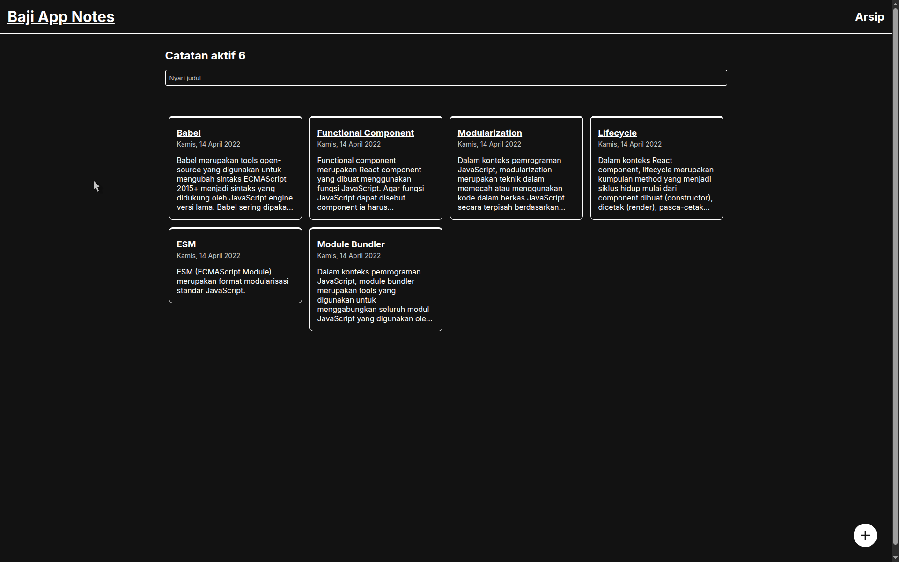

<div id="top" align="center">
  <h1>📝 Baji Personal Notes App</h1>
  <p>
    Aplikasi pencatatan pribadi interaktif yang dibangun menggunakan React.js.
    <br />
    <br />
    <a href="https://bajiff.github.io/baji-personal-notes-app-starter/"><strong>Lihat Live Demo »</strong></a>
    ·
    <a href="https://github.com/bajiff/baji-personal-notes-app-starter/issues">Laporkan Bug</a>
  </p>
</div>

<details>
  <summary><strong>Table of Contents</strong></summary>
  <ol>
    <li>
      <a href="#about-the-project">About The Project</a>
      <ul>
        <li><a href="#built-with">Built With</a></li>
      </ul>
    </li>
    <li>
      <a href="#getting-started">Getting Started</a>
      <ul>
        <li><a href="#prerequisites">Prerequisites</a></li>
        <li><a href="#installation">Installation</a></li>
      </ul>
    </li>
    <li><a href="#features">Features</a></li>
    <li><a href="#contributing">Contributing</a></li>
  </ol>
</details>

<hr>

<h2 id="about-the-project">About The Project</h2>



Proyek ini adalah <i>Final Submission</i> (Tugas Akhir) untuk kelas <b>Belajar Membuat Aplikasi Web dengan React</b> di Dicoding. Di dalam proyek ini, Anda dapat menggunakan operasi CRUD untuk membuat catatan, mencari catatan, mengarsipkan catatan, dan memvalidasi sisa karakter pada judul.

<h3 id="built-with">Built With</h3>

* 
* 
* 

<p align="right">(<a href="#top">back to top</a>)</p>


<h2 id="getting-started">Getting Started</h2>

Berikut adalah instruksi untuk melakukan <i>setup</i> proyek ini di <i>local environment</i> Anda agar dapat berjalan dengan baik.

<h3 id="prerequisites">Prerequisites</h3>
Pastikan Anda sudah menginstal npm di perangkat Anda.
* npm

```bash
npm install npm@latest -g
```
<h3 id="installation">Installation</h3>

Clone the repo

```bash
git clone https://github.com/bajiff/baji-personal-notes-app-starter.git
```

Go to project
```bash
cd baji-personal-notes-app-starter
```

Install NPM packages
```bash
npm install
```

Run project (Vite Development Server)
```bash
npm run dev
```
<p align="right">(<a href="#top">back to top</a>)</p>

<h2 id="features">Features</h2>

<ul>
<li><b>Create:</b> Menambahkan catatan baru dengan validasi sisa karakter judul.</li>
<li><b>Read:</b> Menampilkan daftar catatan yang aktif dan yang diarsipkan.</li>
<li><b>Search:</b> Mencari catatan secara spesifik berdasarkan kata kunci judul.</li>
<li><b>Delete:</b> Menghapus catatan secara permanen.</li>
<li><b>Archive:</b> Memindahkan catatan bolak-balik antara status aktif dan arsip.</li>
</ul>

<p align="right">(<a href="#top">back to top</a>)</p>

<h2 id="contributing">Contributing</h2>

Kontribusi adalah hal yang membuat komunitas <i>open source</i> menjadi tempat yang luar biasa untuk belajar, menginspirasi, dan berkreasi. Setiap kontribusi yang Anda berikan akan <b>sangat dihargai</b>.

Jika Anda memiliki saran yang dapat membuat aplikasi ini menjadi lebih baik, silakan <i>fork repo</i> ini dan buat <i>pull request</i>. Anda juga bisa membuka <i>issue</i> dengan tag "enhancement".
Jangan lupa berikan bintang (Star) pada proyek ini! Terima kasih!

<ol>
<li>Fork the Project</li>
<li>Create your Feature Branch (<code>git checkout -b feature/AmazingFeature</code>)</li>
<li>Commit your Changes (<code>git commit -m 'Add some AmazingFeature'</code>)</li>
<li>Push to the Branch (<code>git push origin feature/AmazingFeature</code>)</li>
<li>Open a Pull Request</li>
</ol>

<p align="right">(<a href="#top">back to top</a>)</p>

